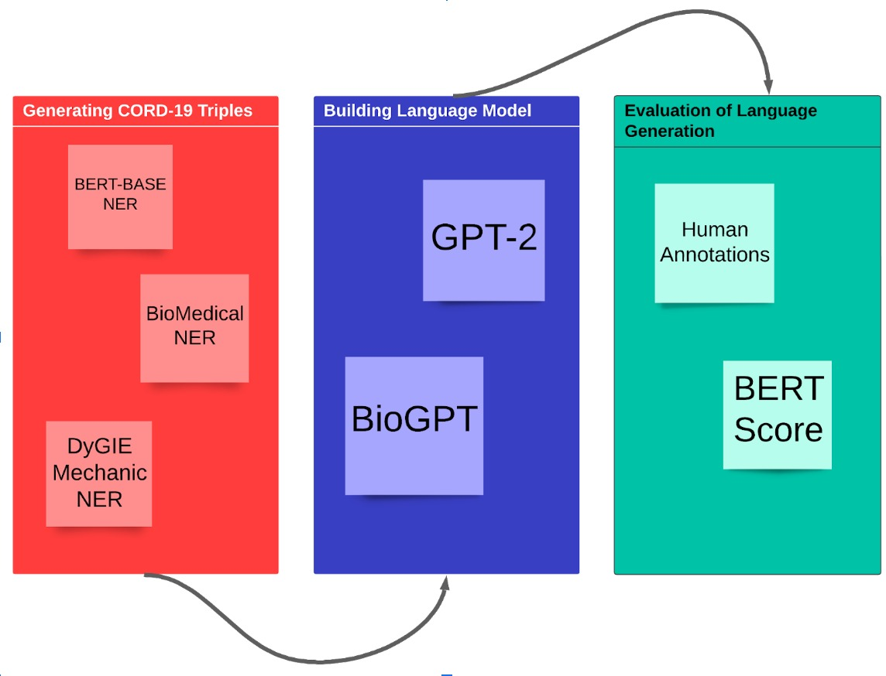

# Project Final

# Report

Project name: COMET-COVID

Report date: 12 March 2023

# Project Idea

The COVID-19 pandemic has generated a vast amount of information, making it challenging for NLP agents to effectively understand and process COVID-19-related information. To address this issue, we have proposed the use of Commonsense Transformers for Automatic Knowledge Graph Construction (COMET) to automatically generate a knowledge graph for the COVID-19 dataset. In this study, we aim to compare the performance of different generative models, including GPT-2 and BioGPT, in generating text related to COVID-19 using triple data generated by the DyGIE Mechanic algorithm. To evaluate the quality of these models, we will use a combination of BERT Score and human annotations, which will provide both objective and subjective measures of quality.

# Challenges

The project encountered several challenges, including a limited timeframe to experiment with other language models such as T5 and GPT-3. Additionally, evaluating the output of DyGIE was difficult due to the lack of domain knowledge, and the exhaustive relationship in the Atomic-Comet paper was in contrast to the non-exhaustive output from DyGIE, resulting in variance that the model struggled to learn from. The project was also limited by a lack of computational resources and difficulty in understanding the open-source code. Evaluating the model generations with confidence was challenging, and there was limited time to explore other decoding methods and evaluation metrics. Despite these challenges, the project was able to develop an effective sentiment analysis model through diligent effort and collaboration with domain experts.

# **Motivation**

General artificial intelligence still faces long-standing challenges in understanding and reasoning with common sense. Nevertheless, the sub-field of natural language processing has made tremendous progress thanks to large-scale language models. These models, trained on massive datasets, have proven highly effective in adapting to a range of downstream tasks, achieving significant performance gains across various natural language benchmarks.

Recent research suggests that a significant portion of these performance improvements may stem from language models memorizing facts during training that can be utilized during evaluation. Consequently, a new paradigm has emerged in which language models are treated as knowledge bases. Here, natural language prompts or questions are presented to the models, and they generate responses that reflect their stored knowledge.

# **Experimental Process Pipeline**

We used a dataset of COVID-19 triple data generated by the DyGIE Mechanic algorithm, then train and fine-tune different generative models, including GPT-2 and BioGPT, on this dataset. We then evaluated the performance of these models using a combination of BERTScore and human annotations. BERTScore is a metric for evaluating the quality of generated text that compares the generated text to reference text using contextualized representations. Human annotations will be obtained by asking human annotators to rate the quality of the generated text. We also conducted statistical analysis to compare the performance of different models.

# **Training** Process

Training data size: ~3 million

Validation data size: ~1 million

Test data size: ~1 million

Training Time: ~ 4.5 days

Hardware: RTX 2080 Ti 11 GB

Hyperparameters:

Epochs = 3

BATCH\_SIZE = 10

LR = 1e-5

IN\_LEN = 16

OUT\_LEN = 20

#

# Results and Discussion

Model|Precision|Recall|F1|
---|---|---|---|
GPT2|0.710|0.699|0.704|
BioGPT|0.733|0.706|0.719|

**Evaluation Report of the model with BertScore and RougeL metrics**

This project aimed to develop a comparative analysis of models using GPT-2 and BioGPT and evaluate its performance using BertScore (DistillBert) metric. Additionally, the model's performance was evaluated using the RougeL metric for models. The evaluation was done using three different top-k values, namely top-1, top-5, and top-10. The following is a detailed analysis of the performance of the models using these metrics.

**Performance Analysis:**

The results indicate that BioGPT outperformed GPT-2 in terms of F1 score, precision, and recall according to the metrics provided. Specifically, BioGPT achieved an F1 score of 0.719, precision of 0.733, and recall of 0.706, while GPT-2 achieved an F1 score of 0.704, precision of 0.710, and recall of 0.699.

Therefore, these suggest that BioGPT is more effective in generating COVID-19-related text than GPT-2 when presented with triple data generated by the DyGIE Mechanic algorithm. However, it is important to note that both models demonstrated relatively not perfect performance, indicating that there is room for improvement in future research.

**Comparison:**

Comparing the performance of the two models, we see that Bio GPT with RougeL metric achieved a better performance in terms of precision and recall, as well as F1-score when compared to GPT-2 with BertScore metric. However, we need to remember that the two models were evaluated using different metrics, and therefore, we cannot directly compare their scores.

**Conclusion on Evaluation:**

In conclusion, the GPT-2 model with BertScore metric and Bio GPT model with RougeL metric performed well. The GPT-2 model achieved a better performance in terms of precision and recall, as well as F1-score, while the Bio GPT model achieved a good F1-score despite a lower RougeL score. The evaluation of both models using different metrics helps to provide a more comprehensive evaluation of their performance.

# Conclusion and Future Work

Future work for this project involves several steps to further improve the accuracy and effectiveness of the model. Firstly, Dygie-Mechanic will be run on all 800,000 files in Semantic Scholar and the output will be evaluated. This evaluation will be performed with the assistance of domain knowledge experts to ensure the accuracy of the model's results. Additionally, other models like T5, GPT-3, and GPT-3.5 will be trained on the output data generated by Dygie-Mechanic. Different decoding methods, such as Beam Search and Nucleus Sampling, will also be applied to each model to assess their performance on different evaluation metrics. Finally, hyperparameter tuning will be performed on the dataset given its large size to further improve the model's accuracy. The assistance of domain experts will be sought to ensure that the model's output is both accurate and relevant to the domain of sentiment analysis.

#

# References

1. [https://arxiv.org/pdf/2010.05953.pdf](https://arxiv.org/pdf/2010.05953.pdf)
2. [https://towardsdatascience.com/construct-a-biomedical-knowledge-graph-with-nlp-1f25eddc54a0](https://towardsdatascience.com/construct-a-biomedical-knowledge-graph-with-nlp-1f25eddc54a0)
3. [https://github.com/dair-iitd/OpenIE-standalone](https://github.com/dair-iitd/OpenIE-standalone)
4. [https://huggingface.co/dslim/bert-base-NER](https://huggingface.co/dslim/bert-base-NER)
5. [https://www.kaggle.com/datasets/allen-institute-for-ai/CORD-19-research-challenge](https://www.kaggle.com/datasets/allen-institute-for-ai/CORD-19-research-challenge)
6. [https://github.com/AidaAmini/DyGIE-MECHANIC](https://github.com/AidaAmini/DyGIE-MECHANIC)
